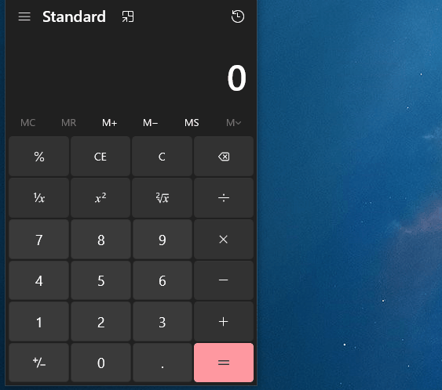
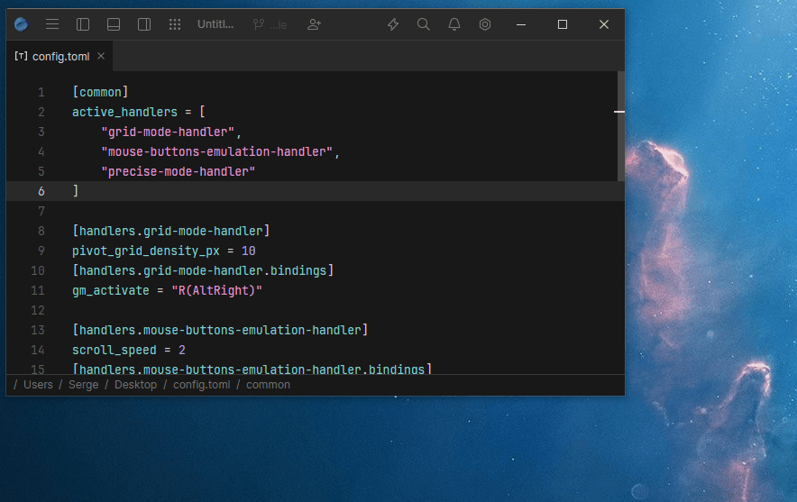

    <h1>QUIN</h1>
    <strong>Set of utilities to enhance OS experience and increase user productivity and efficiency.</strong>

> [!WARNING]
> Project is unstable and underdevelopment. Only Windows is currently supported.
> If you encounter a problem or have an idea for improvement,
> feel free to [create issue](https://github.com/lkaratl/quin/issues/new).

## Features

| Feature                     | Plugin                                                                  | Description                                                                                           | Demo                                                             |
|-----------------------------|-------------------------------------------------------------------------|-------------------------------------------------------------------------------------------------------|------------------------------------------------------------------|
| Tiling window manager       | [tiling_window_manager](./docs/plugins/tiling_window_manager/README.md) | Integration with [Komorebi](https://github.com/LGUG2Z/komorebi) tiling window manager                 | -                                                                |
| Navigate cursor with keys   | [navigation_grid](./docs/plugins/navigation_grid/README.md)             | Move a cursor to the desired region of the screen by pressing a sequence of keys                      |      |
| Control mouse with keyboard | [keyboard_to_mouse](./docs/plugins/keyboard_to_mouse/README.md)         | Simulate mouse actions using keyboard                                                                 |  |
| Tray                        | -                                                                       | Displays the program running in the background as a tray and allows to interact with it via tray menu | -                                                                |
| Auto startup                | -                                                                       | Automatically launches the program when the operating system  starts                                  | -                                                                |

## Plugins

| Plugin                                                                  | Windows            | Linux           | MacOS           |
|-------------------------------------------------------------------------|--------------------|-----------------|-----------------|
| tray                                                                    | :heavy_check_mark: | :x:             | :x:             |
| [global_input](./docs/plugins/input/global/README.md)                   | :heavy_check_mark: | :grey_question: | :grey_question: |
| [input_sequence](./docs/plugins/input/sequence/README.md)               | :heavy_check_mark: | :grey_question: | :grey_question: |
| [gui](./docs/plugins/gui/README.md)                                     | :heavy_check_mark: | :grey_question: | :grey_question: |
| overlay                                                                 | :heavy_check_mark: | :grey_question: | :grey_question: |
| [keyboard_to_mouse](./docs/plugins/keyboard_to_mouse/README.md)         | :heavy_check_mark: | :grey_question: | :grey_question: |
| [navigation_grid](./docs/plugins/navigation_grid/README.md)             | :heavy_check_mark: | :grey_question: | :grey_question: |
| [mouse_output](./docs/plugins/output/mouse/README.md)                   | :heavy_check_mark: | :grey_question: | :grey_question: |
| [tiling_window_manager](./docs/plugins/tiling_window_manager/README.md) | :heavy_check_mark: | :x:             | :x:             |

## License

This project is licensed under the [GNU license](LICENSE).
